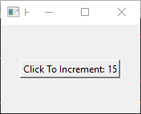
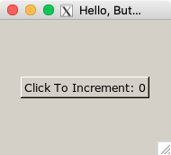

# [](https://github.com/AndyObtiva/glimmer) Glimmer DSL for FX 0.0.2
## FOX Toolkit Ruby Desktop Development GUI Library
[](http://badge.fury.io/rb/glimmer-dsl-fx)
[](https://gitter.im/AndyObtiva/glimmer?utm_source=badge&utm_medium=badge&utm_campaign=pr-badge&utm_content=badge)

[Glimmer](https://github.com/AndyObtiva/glimmer) DSL for [FX](http://www.fox-toolkit.org/) enables building desktop applications with the [FOX Toolkit](http://www.fox-toolkit.org/) via [FXRuby](https://github.com/larskanis/fxruby).

[FOX Toolkit](http://www.fox-toolkit.org/) is the most popular cross-platform desktop GUI toolkit in [MRI Ruby](https://www.ruby-lang.org), having [900,000+ FXRuby gem downloads](https://rubygems.org/gems/fxruby) and counting! 

[FOX Toolkit](http://www.fox-toolkit.org/)'s forte is definitely Windows where no prerequisites are needed given that [FXRuby](https://github.com/larskanis/fxruby) includes Windows binaries out of the box.

[Glimmer DSL for FX](https://rubygems.org/gems/glimmer-dsl-fx) aims to supercharge productivity and maintainability in developing [FOX Toolkit Ruby](https://rubygems.org/gems/fxruby) applications by providing a DSL similar to [Glimmer DSL for SWT](https://github.com/AndyObtiva/glimmer-dsl-swt) having:
- Declarative DSL syntax that visually maps to the GUI widget hierarchy
- Convention over configuration via smart defaults and automation of low-level details
- Requiring the least amount of syntax possible to build GUI
- Custom control support
- Bidirectional Data-Binding to declaratively wire and automatically synchronize GUI with Business Models
- Scaffolding for new custom widgets, apps, and gems
- Native-Executable packaging on Mac, Windows, and Linux.

Hello, World!

```ruby
app('HelloWorld', 'Glimmer') {
  main_window('Hello, World!') {
    label('Hello, World!', opts: [:layout_center_x, :layout_center_y])
  }
}.run
```

Windows | Mac
--------|----
 | 

NOTE: Glimmer DSL for FX is currently in early alpha mode (incomplete proof-of-concept). If you want it developed faster, then [open an issue report](https://github.com/AndyObtiva/glimmer-dsl-fx/issues/new). I have completed some GitHub project features much faster before due to [issue reports](https://github.com/AndyObtiva/glimmer-dsl-fx/issues) and [pull requests](https://github.com/AndyObtiva/glimmer-dsl-fx/pulls). Please help make better by contributing, adopting for small or low risk projects, and providing feedback. It is still an early alpha, so the more feedback and issues you report the better.Please help make better by contributing, adopting for small or low risk projects, and providing feedback. It is still an early alpha, so the more feedback and issues you report the better.

Learn more about the differences between various [Glimmer](https://github.com/AndyObtiva/glimmer) DSLs by looking at the **[Glimmer DSL Comparison Table](https://github.com/AndyObtiva/glimmer#glimmer-dsl-comparison-table)**.

## Prerequisites

### Linux

Run:

```
sudo apt-get install g++ libxrandr-dev libfox-1.6-dev
```

### Mac

Make sure [Homebrew](https://brew.sh/) is installed (e.g. by running `/bin/bash -c "$(curl -fsSL https://raw.githubusercontent.com/Homebrew/install/HEAD/install.sh)"`).

Run:

```
brew install fox
brew install xquartz
```

### Windows

The [glimmer-dsl-fx](https://rubygems.org/gems/glimmer-dsl-fx) gem already contains all required library dependencies.

## Setup

### Option 1: Install

Run this command to install directly:
```
gem install glimmer-dsl-fx
```

### Option 2: Bundler

Add the following to `Gemfile`:
```
gem 'glimmer-dsl-fx', '~> 0.0.2'
```

And, then run:
```
bundle
```

## Usage

Require the library and mixin the `Glimmer` module to utilize the Glimmer GUI DSL for FX:

```ruby
app('HelloWorld', 'Glimmer') {
  main_window('Hello, World!') {
    label('Hello, World!', opts: [:layout_center_x, :layout_center_y])
  }
}.run
```

For actual application development outside of simple demos, mixin the `Glimmer` module into a custom application class instead:

```ruby
require 'glimmer-dsl-fx'

class SomeGlimmerApplication
  include Glimmer
  
  def launch
    app('HelloWorld', 'Glimmer') {
      main_window('Hello, World!') {
        label('Hello, World!', opts: [:layout_center_x, :layout_center_y])
      }
    }.run
  end
end

SomeGlimmerApplication.new.launch
```

## Glimmer GUI DSL

The Glimmer GUI DSL enables development of desktop graphical user interfaces in a manner similar to HTML, but in one language, Ruby, thus avoiding the multi-language separation dissonance encountered on the web, especially given that Ruby looping/conditional constructs do not need scriptlets to be added around View code. This makes desktop development extremely productive.

1 - Keywords

Always start with `app`.

Inside `app`, nest `main_window`, and inside `main_window`, you may declare any [FOX Toolkit control](http://www.fox-toolkit.org/ref16/classes.html) with its keyword, which is the underscored version of the class name minus the `FX` prefix. For example, `label` is the keyword for [`FXLabel`](http://www.fox-toolkit.org/ref16/classFX_1_1FXLabel.html)

Examples:

```ruby
label
button
text_field
```

2 - Arguments

Every [FOX Toolkit](http://www.fox-toolkit.org/) control usually requires one main argument that is [the second argument in the C++ API](http://www.fox-toolkit.org/ref16/classFX_1_1FXButton.html#a0) (e.g. button text or text_field column width) and extra kwargs specific to each control, like `:opts`, `:width`, and `:height` for `button`.

The [FOX Toolkit](http://www.fox-toolkit.org/) `:opts` argument value is usually bit-or'ed `Fox` constants (e.g. `FRAME_RAISED|FRAME_THICK`). In [Glimmer DSL for FX](https://rubygems.org/gems/glimmer-dsl-fx), you simply supply them as a downcased underscored `Symbol` `Array` separated by commas (e.g. `[:frame_raised, :frame_thick]`)

Example:

```ruby
label('Full Name', opts: [:layout_top, :justify_left])
button('Submit Form', opts: [:frame_raised, :frame_thick], icon: submit_icon, width: 300, height: 200)
text_field(20, opts: [:justify_right, :frame_sunken, :frame_thick, :layout_side_top])
```

The recommended style is to always wrap arguments with parentheses for control keywords.

3 - Content Block

You may pass a content block to any [FOX Toolkit](http://www.fox-toolkit.org/) control keyword, which contains attributes and/or nested controls.

Example:

```ruby
app('HelloWorld', 'Glimmer') {
  main_window('Hello, World!') {
    width 320
    height 240
  
    vertical_frame {
      label('Hello, Label!')
      button('Hello, Button!')
    }
  }
}.run
```

The recommended style for the content block is always curly braces `{}` to denote as View nesting code different from looping/conditional logic, which utilizes `do;end` instead.

Attribute arguments never have parentheses.

4 - Listeners

You may declare listeners with `on(message_type) {...}` where `message_type` is an underscored `Symbol` version of a `Fox::SEL_XYZ` message type constant (e.g. `SEL_COMMAND`, `SEL_SELECTED`, `SEL_KEYPRESS`, `SEL_KEYRELEASE`, `SEL_CLICKED`, `SEL_LEFTBUTTONPRESS`, or `SEL_LEFTBUTTONRELEASE`), but without the `SEL_` prefix. For example: `on(:command) {...}`, `on(:selected) {...}`, `on(:keypress) {...}`, `on(:keyrelease) {...}`, `on(:clicked) {...}`, `on(:leftbuttonpress) {...}`, and `on(:leftbuttonrelease) {...}`.

Example:

```ruby
app('HelloWorld', 'Glimmer') {
  main_window('Hello, World!') {
    button('Hello, Button!') { |b|
      on(:command) {
        b.text = 'Clicked'
      }
    }
  }
}.run
```

The recommended style for listeners is always a `do; end` block.

5 - Component Proxy & Methods

When utilizing the Glimmer GUI DSL, you get back proxy objects that wrap [FOX Toolkit](http://www.fox-toolkit.org/) controls. To access the original control wrapped by the proxy object, you may call the `#fx` method.

Furthermore, you may invoke any method available on the control indirectly on the proxy object, like the `#text` method on `label`.

```ruby
label1 = nil
app('HelloWorld', 'Glimmer') {
  main_window('Hello, World!') {
    label1 = label('Full Name')
  }
}
puts label1.text # prints: Full Name
puts label1.fx.text # prints: Full Name
label1.text = 'Name'
puts label1.text # prints: Name
puts label1.fx.text # prints: Name
label1.fx.text = 'Whole Name'
puts label1.text # prints: Whole Name
puts label1.fx.text # prints: Whole Name
```

6 - Observe Model Attributes

In Smalltalk-MVC ([Model View Controller](https://en.wikipedia.org/wiki/Model%E2%80%93view%E2%80%93controller) Architectural Pattern), the View is an active View that observes the Model for changes and updates itself.


This can be achieved with the Glimmer GUI DSL using the `observe` keyword, which takes a model (any object, including `self`) and attribute Symbol or String expression (e.g. `:count` or `'address.street'`), and decouples the Model from the View.

The model is automatically enhanced as an `Glimmer::DataBinding::ObservableModel` / `Glimmer::DataBinding::ObservableHash` / `Glimmer::DataBinding::ObservableArray` depending on its type to support notifying observers of attribute changes (when performed using the attribute writer, which automatically calls added method `notify_observers(attribute)`)

Note that it is usually recommended to observe external model objects (not `self`), but `self` is OK in very simple cases or presentation-related attributes only.

Example:

```ruby
require 'glimmer-dsl-fx'

class Counter
  attr_accessor :count

  def initialize
    self.count = 0
  end
end

class HelloButton
  include Glimmer
  
  def initialize
    @counter = Counter.new

    observe(@counter, :count) do |new_count|
      @button.text = "Click To Increment: #{new_count}"
    end
  end
  
  def launch
    app('HelloButton', 'Glimmer') {
      main_window('Hello, Button!') {
        @button = button('Click To Increment: 0', opts: [:frame_raised, :frame_thick, :layout_center_x, :layout_center_y]) {
          on(:command) do
            @counter.count += 1
          end
        }
      }
    }.run
  end
end

HelloButton.new.launch
```

Windows | Mac
--------|----
 | 

## Smart Defaults and Conventions

- `app` automatically shows `main_window` upon calling `run` while staring the main event loop.
- `app` automatically invokes `open -a /Applications/Utilities/XQuartz.app` upon running on Mac.
- Declaring `app` multiple times always returns the first `app` created ([FOX Toolkit](http://www.fox-toolkit.org/) does not support multiple `app` instances)

## Girb (Glimmer IRB)

You can run the `girb` command (`bin/girb` if you cloned the project locally):

```
girb
```

Windows | Mac
--------|----
 | 

This gives you `irb` with the `glimmer-dsl-fx` gem loaded and the `Glimmer` module mixed into the main object for easy experimentation with GUI.

Note: GIRB for Glimmer DSL for FX 0.0.2 is still very rudimentary and does not support entering code for multiple applications, yet only one. You would have to exit and re-enter after each application entered.

Gotcha: On the Mac, when you close a window opened in `girb`, it remains open until you enter `exit`.

## Samples

You may checkout the [samples](samples) directory for examples of using [Glimmer DSL for FX](https://rubygems.org/gems/glimmer-dsl-fx).

### Hello Samples

#### Hello, World!

[samples/hello/hello_world.rb](/samples/hello/hello_world.rb)

Windows | Mac
--------|----
 | 

Run (via installed gem):

```
ruby -r glimmer-dsl-fx -e "require 'samples/hello/hello_world'"
```

Run (via locally cloned project):

```
ruby -r ./lib/glimmer-dsl-fx.rb samples/hello/hello_world.rb
```

Code:

```ruby
require 'glimmer-dsl-fx'

include Glimmer

app('HelloWorld', 'Glimmer') {
  main_window('Hello, World!') {
    label('Hello, World!')
  }
}.run
```

#### Hello, Button!

[samples/hello/hello_button.rb](/samples/hello/hello_button.rb)

Windows | Mac
--------|----
 | 

Run (via installed gem):

```
ruby -r glimmer-dsl-fx -e "require 'samples/hello/hello_button'"
```

Run (via locally cloned project):

```
ruby -r ./lib/glimmer-dsl-fx.rb samples/hello/hello_button.rb
```

Code:

```ruby
require 'glimmer-dsl-fx'

class HelloButton
  include Glimmer
  
  def initialize
    @count = 0
  end
  
  def launch
    app('HelloButton', 'Glimmer') {
      main_window('Hello, Button!') {
        @button = button("Click To Increment: 0", opts: [:frame_raised, :frame_thick, :layout_center_x, :layout_center_y]) {
          on(:command) do
            @count += 1
            @button.text = "Click To Increment: #{@count}"
          end
        }
      }
    }.run
  end
end

HelloButton.new.launch
```

## Resources

- fxruby gem: https://github.com/larskanis/fxruby
- FOX Toolkit: http://www.fox-toolkit.org
- FOX Toolkit Documentation: http://www.fox-toolkit.org/doc.html
- FOX Toolkit 1.6 API Reference: http://www.fox-toolkit.org/ref16/classes.html

## Process

[Glimmer Process](https://github.com/AndyObtiva/glimmer/blob/master/PROCESS.md)

## Help

### Issues

If you encounter [issues](https://github.com/AndyObtiva/glimmer-dsl-fx/issues) that are not reported, discover missing features that are not mentioned in [TODO.md](TODO.md), or think up better ways to use FX than what is possible with [Glimmer DSL for FX](https://rubygems.org/gems/glimmer-dsl-fx), you may submit an [issue](https://github.com/AndyObtiva/glimmer-dsl-fx/issues/new) or [pull request](https://github.com/AndyObtiva/glimmer-dsl-fx/compare) on [GitHub](https://github.com). In the meantime while waiting for a fix, you may try older gem versions of [Glimmer DSL for FX](https://rubygems.org/gems/glimmer-dsl-fx) in case you find one that does not have the issue and actually works.

### Chat

If you need live help, try to [](https://gitter.im/AndyObtiva/glimmer?utm_source=badge&utm_medium=badge&utm_campaign=pr-badge&utm_content=badge)

## Planned Features and Feature Suggestions

These features have been planned or suggested. You might see them in a future version of [Glimmer DSL for FX](https://rubygems.org/gems/glimmer-dsl-fx). You are welcome to contribute more feature suggestions.

[TODO.md](TODO.md)

## Change Log

[CHANGELOG.md](CHANGELOG.md)

## Contributing

-   Check out the latest master to make sure the feature hasn't been
    implemented or the bug hasn't been fixed yet.
-   Check out the issue tracker to make sure someone already hasn't
    requested it and/or contributed it.
-   Fork the project.
-   Start a feature/bugfix branch.
-   Commit and push until you are happy with your contribution.
-   Make sure to add tests for it. This is important so I don't break it
    in a future version unintentionally.
-   Please try not to mess with the Rakefile, version, or history. If
    you want to have your own version, or is otherwise necessary, that
    is fine, but please isolate to its own commit so I can cherry-pick
    around it.

## Contributors

* [Andy Maleh](https://github.com/AndyObtiva) (Founder)

[Click here to view contributor commits.](https://github.com/AndyObtiva/glimmer-dsl-fx/graphs/contributors)

## Copyright

[LGPL](LICENSE.txt)

Copyright (c) 2021 Andy Maleh.

--

[](https://github.com/AndyObtiva/glimmer) Built for [Glimmer](https://github.com/AndyObtiva/glimmer) (DSL Framework).
